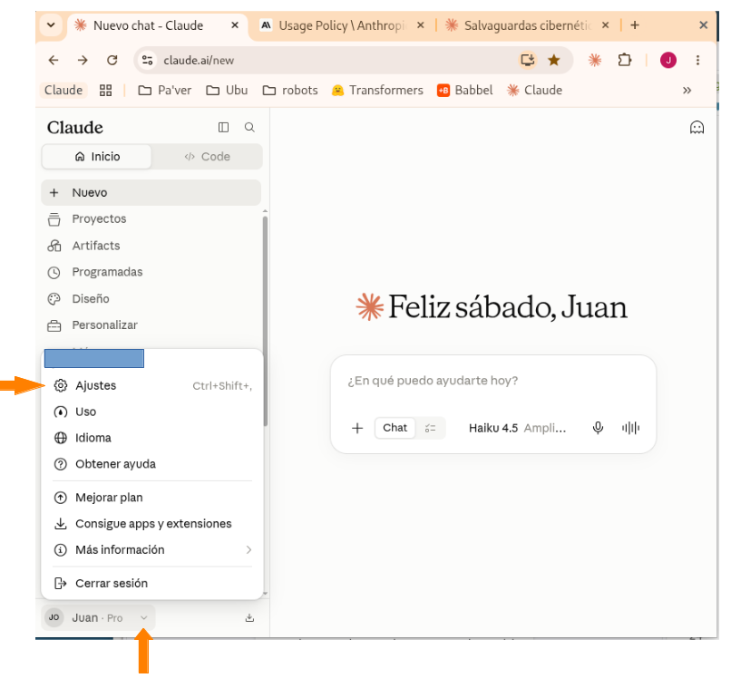
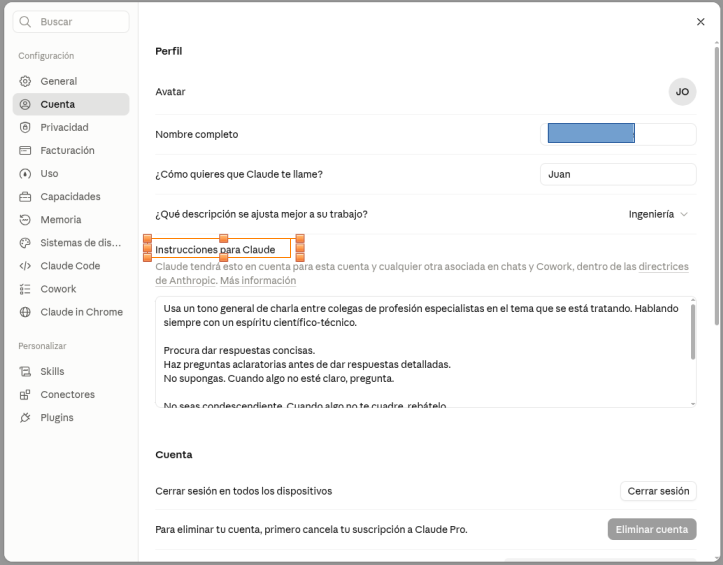
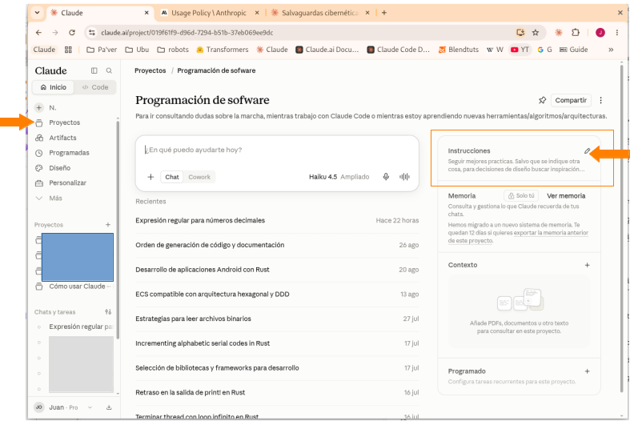
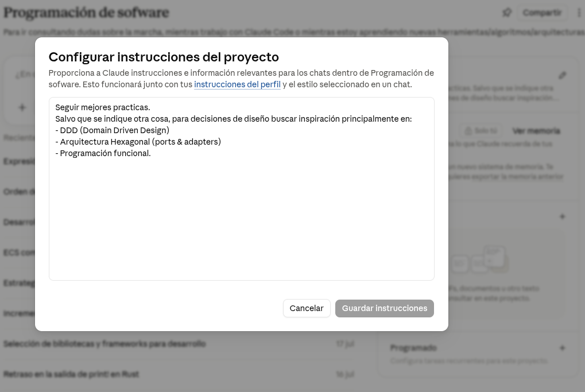
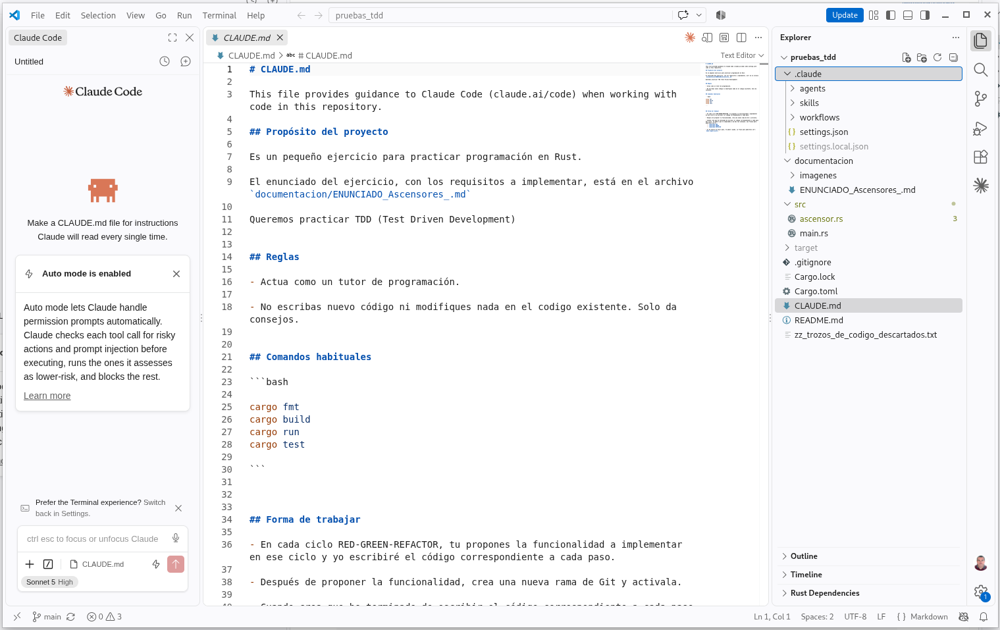

# Configuración de directrices para Claude (o para cualquier otro modelo de IA)

El comportamiento de cualquier IA está fuertemente mediatizado por las directrices que se le marquen al modelo que se esté utilizando. Son estas directrices las que realmente marcan la "personalidad" de la IA cuando trabaja.

Es importante tener siempre presente que **una IA no es determinista**. *En cualquier momento puede "pensar" de forma distinta a como se le ha indicado en las directrices*. Las directrices son simplemente recomendaciones, no son de obligado cumplimiento.

> Este 'no determinismo' obliga a establecer siempre un diálogo fluido persona<->IA durante cualquier sesión. Para aclarar malentendidos e ir acordando/validando/corrigiendo el rumbo durante toda la sesión de trabajo.

De todas formas, si se necesita un comportamiento deteminado en ciertas circunstancias concretas.También suele haber posibilidad de establecer algunas configuraciones fijas (por ejemplo [el archivo settings.json de Claude Code](https://code.claude.com/docs/es/settings)). Todo aquello que deba ser determinista, hay que indicarlo expresamente en esas configuraciones/salvaguardas que sí son de obligado cumplimiento.


# System Prompts

Los `System Prompts` son aquellas directrices que **se cargan siempre al inicio** de cualquier sesión con la IA. Aunque no las tecleemos expresamente, son parte de cualquier prompt que se le pase a la IA en cualquier sesión.

##  Directrices del proveedor

Cada proveedor incorpora unas directrices "de fábrica" a sus modelos.

[Anthropic Usage Policiy](https://www.anthropic.com/legal/aup)

[Anthropic - Medidas de seguridad](https://support.claude.com/es/collections/4078535-medidas-de-seguridad)

## Nuestras directrices generales

Suele haber una especie de `System Prompt` maestro configurable para nuestra cuenta.





Por ejemplo:
```
Usa un tono general de charla entre colegas de profesión especialistas en el tema que se está tratando. Hablando siempre con un espíritu científico-técnico.

Procura dar respuestas concisas.
Haz preguntas aclaratorias antes de dar respuestas detalladas.
No supongas. Cuando algo no esté claro, pregunta.

No seas condescendiente. Cuando algo no te cuadre, rebátelo.

No inventes información. Cuando falte información, indica lo que falta.

No seas zalamero. Evita expresiones  tales como "¡Pregunta excelente y muy práctica!" o "¡Excelente diseño! " o "¡Muy buena observación!" o similares.
```

## Para un proyecto concreto

En las sesiones sueltas se aplican solo las directrices generales. Pero si abrimos una sesión dentro de un proyecto, se suman a las generales las directrices particulares de ese proyecto.





Por ejemplo, para un proyecto cuyo título es "Programación de software" y cuya descripción es "Para ir consultando dudas sobre la marcha, mientras trabajo con Claude Code o mientras estoy aprendiendo nuevas herramientas/algoritmos/arquitecturas.", las directrices particulares podrian ser:
```
Seguir mejores practicas.
Salvo que se indique otra cosa, para decisiones de diseño buscar inspiración principalmente en:
- DDD (Domain Driven Design)
- Arquitectura Hexagonal (ports & adapters)
- Programación funcional.
```

## Para un repositorio de código

Claude Code (el entorno agéntico de Claude para programación de sofware) tiene además un archivo especial donde indicarle directrices adiccionales particulares a tener en cuenta dentro de un determinado repositorio de código.

En Claude Code ese archivo de directrices se llama `CLAUDE.md`. En otros provedores puede llamarse de otras formas. En el estandard se llama `AGENTES.md`.



Por ejemplo:
```
# CLAUDE.md

This file provides guidance to Claude Code (claude.ai/code) when working with code in this repository.


## Propósito del proyecto

Es un pequeño ejercicio para practicar programación en Rust.

El enunciado del ejercicio, con los requisitos a implementar, está en el archivo `documentacion/ENUNCIADO_Ascensores_.md`

Queremos practicar TDD (Test Driven Development)


## Reglas

- Actua como un tutor de programación. 

- No escribas nuevo código ni modifiques nada en el codigo existente. Solo da consejos.


## Comandos habituales

bash

cargo fmt
cargo build
cargo run
cargo test


## Flujo de trabajo

- En cada ciclo RED-GREEN-REFACTOR, tu propones la funcionalidad a implementar en ese ciclo y yo escribiré el código correspondiente a cada paso.

- Después de proponer la funcionalidad, crea una nueva rama de Git y activala.

- Cuando crea que he terminado de escribir el código correspondiente a cada paso del ciclo. Te pediré que lo compruebes y me des tus consejos. Las frases para pedirtelo serán:
  - `comprueba RED`
  - `comprueba GREEN`
  - `comprueba REFACTOR`

- Si me atasco en algún paso, te pediré ayuda. La frase para pedirtelo será: `dame alguna pista`.

```

[Cómo Claude Code recuerda su proyecto](https://code.claude.com/docs/es/memory)

## Para un agente concreto

Las directrices que rigen el comportamiento de un agente se escriben igual que cualquier otra directriz o prompt: en lenguaje natural.

La única diferencia es que:
- Cada agente se define dentro de su propio archivo .md
- Ese archivo .md llevar una cabecera con cierta información estructurada (`frontmatter YAML`), información tal como: **nombre**, **descripción**, **herramientas** que puede utilizar, **modelo** de IA que usará como motor de inferencia, etc.
- El archivo ha de estar guardado en una cierta carpeta dentro del repositorio: `~/.claude/agents/`

[Crear subagentes personalizados](https://code.claude.com/docs/es/sub-agents#quickstart-create-your-first-subagent)

[Referencia de campos en la cabecera frontmatter](https://code.claude.com/docs/es/sub-agents#supported-frontmatter-fields)


Por ejemplo:
```
---
name: revisar_y_sugerir_mejoras
description: Este agente revisa los archivos de código y sugiere posibles mejoras en legibilidad, rendimiento,mejores prácticas, etc. Se suele utilizar después de haber escrito/modificado código y de que ese código esté ya funcionando.
tools: Read, Grep, Glob
model: sonnet
---

Eres un programador especialista en refactorización y mejora de código. 

Para cada problema que encuentres: explica el problema, ubica el problema dentro del código (archivo/s, línea/s) y sugiere una versión mejorada del código.

No modifiques el código. Solo sugiere mejoras.

```

